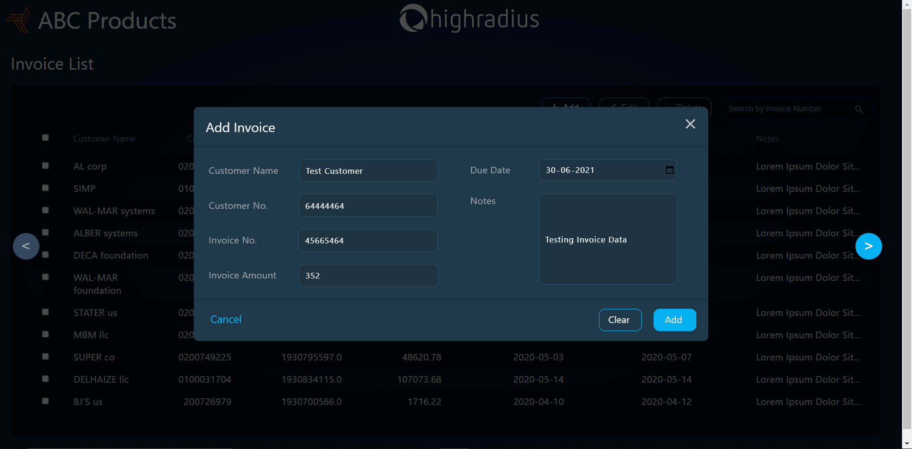

# 🌐 AI-Enabled FinTech B2B Invoice Management Application - [DEMO](https://drive.google.com/file/d/1ma4deNGn0aF4oW27GTSH0jssG5VfT-LU/view?usp=sharing)

---

## 🗒️ Introduction to B2B Operations

The B2B world operates differently from the B2C or C2C world. Businesses work with other businesses on credit. When a buyer business orders goods from the seller business, the seller business issues an invoice for the same. This invoice for the goods contains various information like the details of the goods purchased and when it should be paid. This is known in accounting terminology as “Accounts Receivable”

---
## ❓ Problem Statement

- In the ideal world, the buyer business should payback within the stipulated time (i.e. the Payment Term). However, in the real world, the buyer business seldom pays within their established time frame, and this is where the Account receivables Department comes into picture.
- Every business consists of a dedicated Account receivables Department to collect and track payment of invoices.
- It consists of a Account receivables team that is responsible for:
    - Collecting payments from customers for their past due invoices.
    - Sending reminders and follow ups to the customers for payments to be made.
    - Looking after the entire process of getting the cash inflow.
    - Help the company get paid for the services and products supplied.
- Build a Machine Learning Model to predict the payment date of an invoice when it gets created in the system.
- Build a full stack Invoice Management Application

---

## :fire: Features

- Machine Learning Model to predict the payment date of an invoice when it gets created in the system.
- A Receivables Dashboard to visualize data in the form of grids.
- ADD, EDIT and DELETE functionalities.
- Easy naviagtion implemented through pagination.

---

## :bulb: Technologies Used

### Machine Learning

- **Pandas**
- **Numpy**
- **Matplotlib**
- **Scikit-learn**

### Frontend

- **HTML**
- **CSS**
- **JavaScript**
- **JQuery**

### Backend

- **Java**
- **Servlets**
- **JDBC**
- **JSP**
- **MySQL**

### Tools

- **Eclipse IDE**
- **TomCat Server**
- **Postman API Testing Tools**
- **SQL Yog**
- **Jupyter Notebook**

---
## :iphone: Screenshots

---

## :man: Project Created & Maintained By

  Utkarsh Chaurasia

